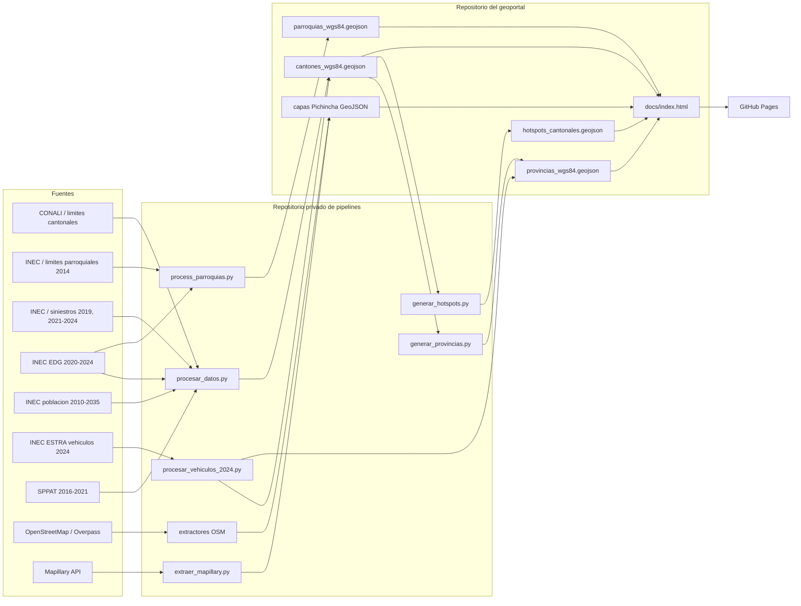

# Arquitectura y flujo de datos

## Vista general

## Repositorios

- `redsa-observatorio-seguridad-vial`: artefactos publicados, frontend,
  documentacion, pruebas de contrato y pruebas Playwright.
- `redsa-observatorio-pipelines`: ETL, extractores, Agente 1, automatizaciones y
  pruebas unitarias. Es privado porque referencia rutas de fuentes crudas y
  procesos que pueden manejar microdatos restringidos.

## Fronteras de responsabilidad

- `docs/data/*.geojson` es producto, no fuente primaria.
- `03_DATOS_FUENTES` en Drive es la zona de aterrizaje de fuentes. No se copia
  al repositorio ni al paquete de auditoria.
- Los scripts escriben agregados; ninguna fila individual EDG/SPPAT debe cruzar
  la frontera hacia el repositorio publico.
- GitHub Pages sirve archivos estaticos. No hay backend, base de datos ni
  autenticacion en el geoportal actual.

## Orden reproducible

1. Verificar variables de entorno y checksums de fuentes.
2. Generar/enriquecer cantones con `procesar_datos.py`.
3. Generar parroquias con `process_parroquias.py`.
4. Derivar provincias con `generar_provincias.py`.
5. Integrar ESTRA 2024 con `procesar_vehiculos_2024.py`.
6. Recalcular provincias para propagar cualquier agregado cantonal posterior.
7. Generar hotspots con `generar_hotspots.py`.
8. Ejecutar contratos de datos y pruebas Playwright antes del push.

El orquestador `scripts/reproducir_geoportal.ps1` del repositorio de pipelines
documenta el comando completo y permite ejecutar etapas individualmente.
