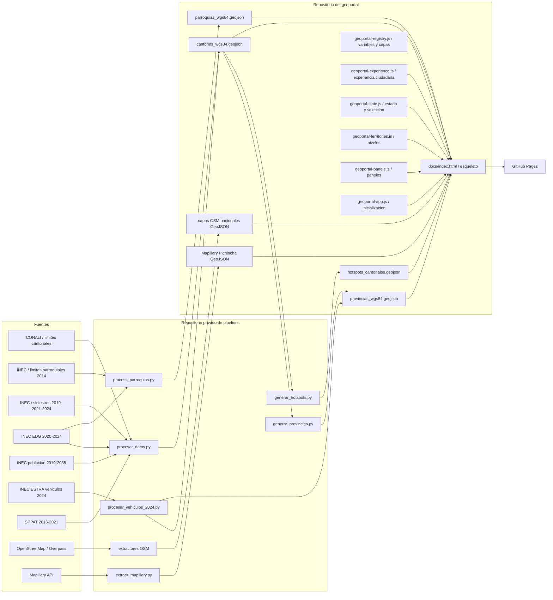

# Arquitectura y flujo de datos

## Vista general

## Repositorios

- `redsa-observatorio-seguridad-vial`: artefactos publicados, frontend,
  documentacion, pruebas de contrato y pruebas Playwright.
- `redsa-observatorio-pipelines`: ETL, extractores, Agente 1, automatizaciones y
  pruebas unitarias. Es privado porque referencia rutas de fuentes crudas y
  procesos que pueden manejar microdatos restringidos.

## Fronteras de responsabilidad

- `docs/data/*.geojson` es producto, no fuente primaria.
- `03_DATOS_FUENTES` en Drive es la zona de aterrizaje de fuentes. No se copia
  al repositorio ni al paquete de auditoria.
- Los scripts escriben agregados; ninguna fila individual EDG/SPPAT debe cruzar
  la frontera hacia el repositorio publico.
- GitHub Pages sirve archivos estaticos. No hay backend, base de datos ni
  autenticacion en el geoportal actual.

## Arquitectura frontend

La pagina usa divulgacion progresiva: la vista publica responde primero por un
canton y el panel `Datos y capas` concentra la operacion tecnica. No existe un
modo de datos alternativo: ambos consumen los mismos GeoJSON y el mismo estado
temporal.

- `docs/assets/js/geoportal-registry.js` es la fuente declarativa para variables,
  capas, simbologia, popups y vista inicial.
- `docs/assets/js/geoportal-experience.js` resuelve busqueda, resumen ciudadano,
  comparacion, compartir y descarga CSV.
- `docs/assets/js/geoportal-state.js` concentra mapa, estado, simbologia y
  seleccion territorial persistente.
- `docs/assets/js/geoportal-territories.js` controla provincias, cantones,
  parroquias, Auto e histeresis por zoom.
- `docs/assets/js/geoportal-panels.js` renderiza sidebar, perfil y graficos.
- `docs/assets/js/geoportal-app.js` inicializa datos, infraestructura, controles
  y la API diagnostica usada por Playwright.
- `docs/assets/css/geoportal-core.css` y `geoportal-experience.css` son las dos
  hojas de estilo de produccion; comparten una unica escala de tokens `--z-*`.
- `docs/index.html` es el esqueleto semantico y carga los archivos estaticos en
  orden. No contiene CSS ni el motor JavaScript inline.

La vista inicial encuadra Ecuador continental, muestra siniestros 2024 y deja
todas las capas de infraestructura apagadas. El modo Auto cambia el nivel por
zoom con histeresis; el usuario puede fijar cualquiera de los tres niveles.

## Orden reproducible

1. Verificar variables de entorno y checksums de fuentes.
2. Generar/enriquecer cantones con `procesar_datos.py`.
3. Generar parroquias con `process_parroquias.py`.
4. Derivar provincias con `generar_provincias.py`.
5. Integrar ESTRA 2024 con `procesar_vehiculos_2024.py`.
6. Recalcular provincias para propagar cualquier agregado cantonal posterior.
7. Generar hotspots con `generar_hotspots.py`.
8. Extraer las capas OSM nacionales y calcular la cobertura de mapeo.
9. Ejecutar contratos de datos y pruebas Playwright antes del push.

El orquestador `scripts/reproducir_geoportal.ps1` del repositorio de pipelines
documenta el comando completo y permite ejecutar etapas individualmente.
