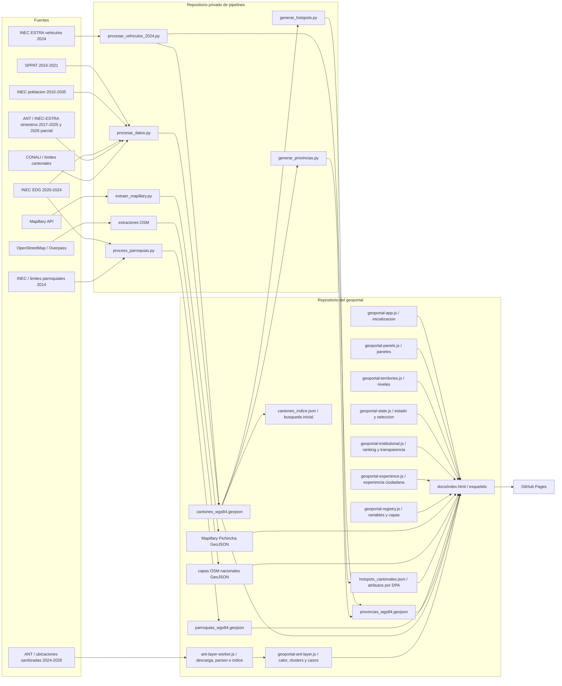

# Arquitectura y flujo de datos

## Vista general

```mermaid
flowchart LR
  subgraph F[Fuentes]
    CONALI[CONALI / limites cantonales]
    INECP[INEC / limites parroquiales 2014]
    SIN[ANT / INEC-ESTRA siniestros 2017-2025 y 2026 parcial]
    ANTP[ANT / ubicaciones sanitizadas 2024-2026]
    EDG[INEC EDG 2020-2024]
    POP[INEC poblacion 2010-2035]
    VEH[INEC ESTRA vehiculos 2024]
    SPPAT[SPPAT 2016-2021]
    OSM[OpenStreetMap / Overpass]
    MAP[Mapillary API]
  end
  subgraph P[Repositorio privado de pipelines]
    BASE[procesar_datos.py]
    PAR[process_parroquias.py]
    PROV[generar_provincias.py]
    HOT[generar_hotspots.py]
    V[procesar_vehiculos_2024.py]
    O[extractores OSM]
    M[extraer_mapillary.py]
  end
  subgraph D[Repositorio del geoportal]
    CANT[cantones_wgs84.geojson]
    PARR[parroquias_wgs84.geojson]
    PROVG[provincias_wgs84.geojson]
    HOTG[hotspots_cantonales.json / atributos por DPA]
    CIDX[cantones_indice.json / busqueda inicial]
    OSMG[capas OSM nacionales GeoJSON]
    MAPG[Mapillary Pichincha GeoJSON]
    WEB[docs/index.html / esqueleto]
    REG[geoportal-registry.js / variables y capas]
    UX[geoportal-experience.js / experiencia ciudadana]
    INST[geoportal-institutional.js / ranking y transparencia]
    STATE[geoportal-state.js / estado y seleccion]
    TERR[geoportal-territories.js / niveles]
    PAN[geoportal-panels.js / paneles]
    APP[geoportal-app.js / inicializacion]
    ANTW[ant-layer-worker.js / descarga, parseo e indice]
    ANTL[geoportal-ant-layer.js / calor, clusters y casos]
  end
  CONALI --> BASE --> CANT
  SIN --> BASE
  ANTP --> ANTW --> ANTL --> WEB
  EDG --> BASE
  POP --> BASE
  SPPAT --> BASE
  INECP --> PAR --> PARR
  EDG --> PAR
  CANT --> PROV --> PROVG
  CANT --> HOT --> HOTG
  CANT --> CIDX
  VEH --> V --> CANT
  V --> PROVG
  OSM --> O --> OSMG
  MAP --> M --> MAPG
  CANT --> WEB
  PARR --> WEB
  PROVG --> WEB
  HOTG --> WEB
  OSMG --> WEB
  MAPG --> WEB
  REG --> WEB
  UX --> WEB
  INST --> WEB
  STATE --> WEB
  TERR --> WEB
  PAN --> WEB
  APP --> WEB
  WEB --> PAGES[GitHub Pages]
```

## Carga territorial progresiva

La vista inicial solicita la capa provincial y `cantones_indice.json`, que solo
contiene códigos y nombres para búsqueda. `cantones_wgs84.geojson` y
`hotspots_cantonales.json` se cargan una sola vez bajo demanda al entrar al
nivel cantonal, seleccionar un cantón, abrir el ranking o activar una función
que necesita geometría cantonal. El índice de hotspots no contiene geometría:
sus resultados se unen por `DPA_CANTON` después de cargar la capa cantonal.

La capa de eventos ANT mantiene telemetría agregada de activación en GA4:
inicio, lista, cancelación, error y cambio de modo. Los eventos incluyen
duración, año, modo, uso de caché y tipo general de conexión; nunca coordenadas
ni nombres/códigos territoriales.

## Repositorios

- `redsa-observatorio-seguridad-vial`: artefactos publicados, frontend,
  documentacion, pruebas de contrato y pruebas Playwright.
- `redsa-observatorio-pipelines`: ETL, extractores, Agente 1, automatizaciones y
  pruebas unitarias. Es privado porque referencia rutas de fuentes crudas y
  procesos que pueden manejar microdatos restringidos.

## Fronteras de responsabilidad

- `docs/data/*.geojson` es producto, no fuente primaria.
- `03_DATOS_FUENTES` en Drive es la zona de aterrizaje de fuentes. No se copia
  al repositorio ni al paquete de auditoria.
- Los scripts escriben agregados; ninguna fila individual EDG/SPPAT debe cruzar
  la frontera hacia el repositorio publico.
- GitHub Pages sirve archivos estaticos. No hay backend, base de datos ni
  autenticacion en el geoportal actual.
- La capa puntual ANT es estrictamente diferida. En modo Calor, el Web Worker
  solicita primero una proyeccion compacta que contiene solo las mismas
  coordenadas publicables del ano. Agrupaciones y Casos descargan el GeoJSON
  completo y construyen Supercluster fuera del hilo principal; si ese archivo
  ya esta en memoria, Calor reutiliza sus coordenadas y no solicita el
  compacto. La cache se limita a un ano y una carga pendiente se cancela al
  cambiar el periodo global.

## Arquitectura frontend

La pagina usa divulgacion progresiva: la vista publica responde primero por un
canton y el panel `Datos y capas` concentra la operacion tecnica. No existe un
modo de datos alternativo: ambos consumen los mismos GeoJSON y el mismo estado
temporal.

- `docs/assets/js/geoportal-registry.js` es la fuente declarativa para variables,
  capas, simbologia, popups y vista inicial.
- `docs/assets/js/geoportal-experience.js` resuelve busqueda, resumen ciudadano,
  comparacion, compartir y descarga CSV.
- `docs/assets/js/geoportal-institutional.js` ofrece el ranking cantonal
  sincronizado con el estado global y las vistas de confianza y citacion. Lee
  el mismo registro de variables y no mantiene una copia de sus descripciones.
- `docs/assets/js/geoportal-state.js` concentra mapa, estado, simbologia y
  seleccion territorial persistente.
- `docs/assets/js/geoportal-territories.js` controla provincias, cantones,
  parroquias, Auto e histeresis por zoom.
- `docs/assets/js/geoportal-panels.js` renderiza sidebar, perfil y graficos.
- `docs/assets/js/geoportal-app.js` inicializa datos, infraestructura, controles
  y la API diagnostica usada por Playwright.
- `docs/assets/css/geoportal-core.css` y `geoportal-experience.css` definen la
  experiencia desktop; `geoportal-mobile.css`, cargado al final, concentra todas
  las reglas para `max-width: 768px`. Comparten una unica escala `--z-*`.
- `docs/index.html` es el esqueleto semantico y carga los archivos estaticos en
  orden con una version comun para invalidar cache. No contiene CSS ni el motor
  JavaScript inline.

La vista inicial encuadra Ecuador continental, muestra siniestros 2025 y deja
todas las capas de infraestructura apagadas. El modo Auto cambia el nivel por
zoom con histeresis; el usuario puede fijar cualquiera de los tres niveles.
En movil, sidebar y panel tecnico son overlays, la leyenda inicia colapsada y la
seleccion territorial se realiza por toque con el mismo estado persistente.
El modal institucional es una vista bajo demanda: no ocupa el mapa ni el
sidebar, conserva la posicion nacional de cada canton al filtrar y excluye del
ranking valores `sin_dato` sin convertirlos en cero.

## Orden reproducible

1. Verificar variables de entorno y checksums de fuentes.
2. Generar/enriquecer cantones con `procesar_datos.py`.
3. Generar parroquias con `process_parroquias.py`.
4. Derivar provincias con `generar_provincias.py`.
5. Integrar ESTRA 2024 con `procesar_vehiculos_2024.py`.
6. Recalcular provincias para propagar cualquier agregado cantonal posterior.
7. Generar hotspots con `generar_hotspots.py`.
8. Extraer las capas OSM nacionales y calcular la cobertura de mapeo.
9. Ejecutar contratos de datos y pruebas Playwright antes del push.

El orquestador `scripts/reproducir_geoportal.ps1` del repositorio de pipelines
documenta el comando completo y permite ejecutar etapas individualmente.
