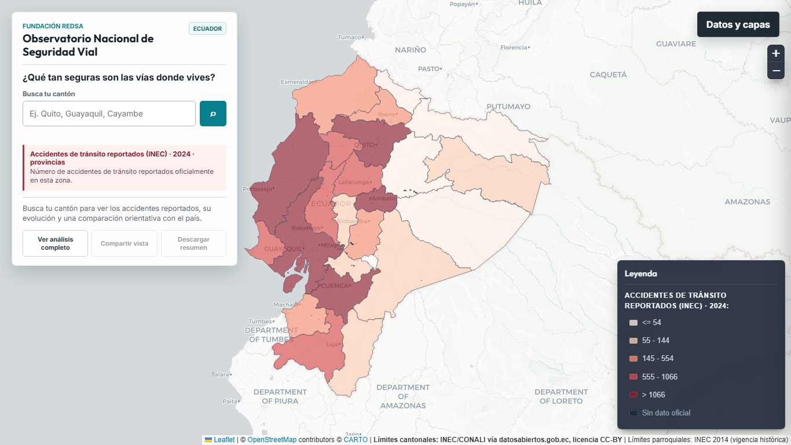
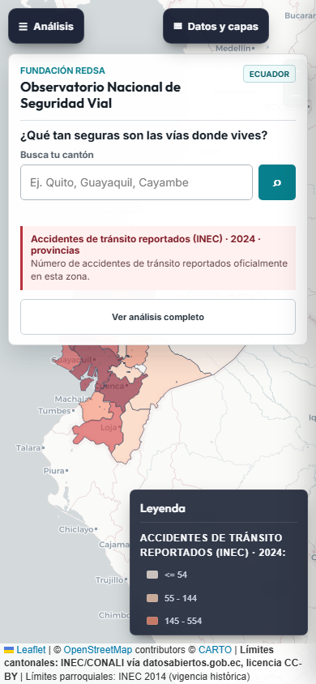
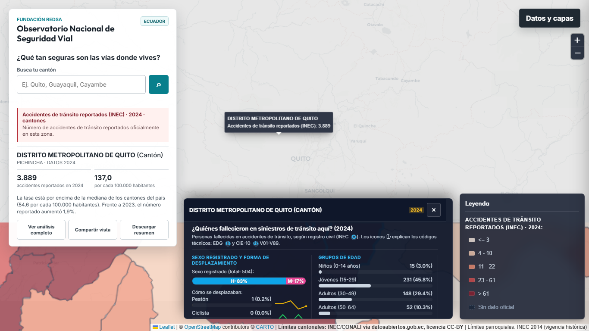
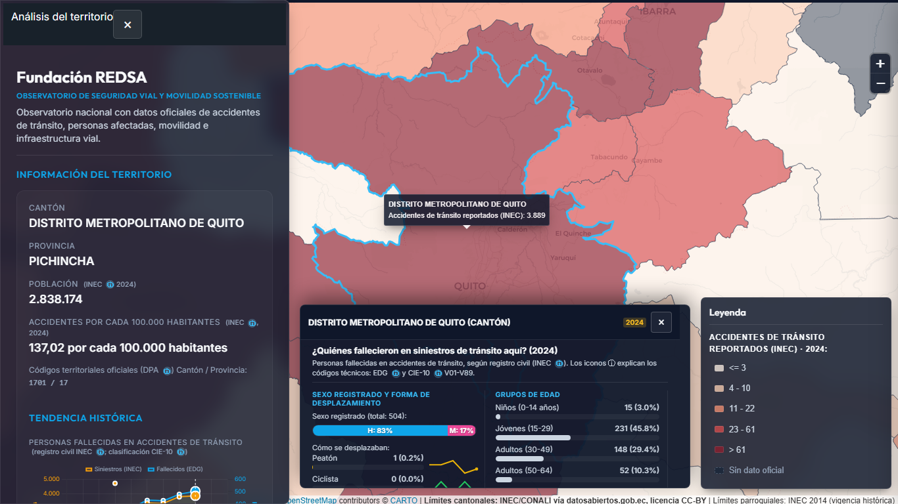
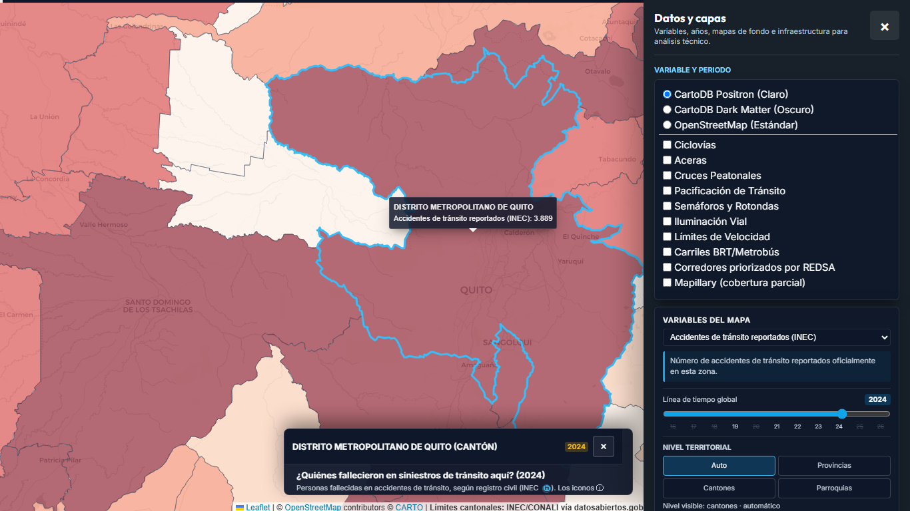
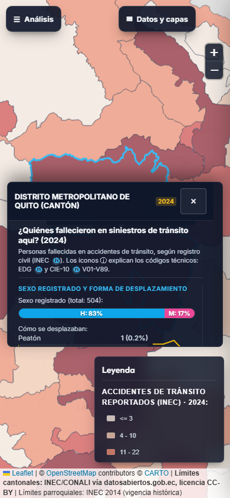
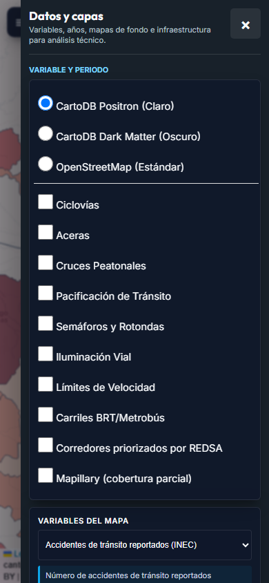

# Evidencia de interaccion territorial profesional

Fecha: 2026-07-16. Viewports: desktop 1366x768 y movil 390x844.

## Alcance verificado

- El primer clic fija una unidad y no abre un popup redundante. Un segundo clic
  conserva el popup historico como accion deliberada.
- Clic en canton limita `fitBounds` a zoom 10 y mantiene nivel canton.
- Hover solo altera estilo/tooltip; sidebar y perfil no cambian.
- El perfil conserva seleccion al hacer scroll y tiene una X fija.
- Auto, Provincias, Cantones y Parroquias son estados visibles y operables.
- Sidebar, drawer tecnico, perfil y leyenda no se intersectan.

## Mediciones

| Estado | Perfil | Obstaculo | Interseccion |
|---|---|---|---|
| Desktop, seleccion | x 426-1050; y 460-740 | Leyenda x 1066-1356 | no |
| Desktop, sidebar | x 456-1050; y 464-744 | Sidebar x 0-440 | no |
| Desktop, drawer tecnico | x 426-950; y 644-744 | Drawer x 966-1366 | no |
| Movil, seleccion | x 12-378; y 308-588 | Leyenda y 604-784 | no |

Los valores completos y el estado de capas estan en
`evidencia_visual/interaccion_profesional/mediciones.json`.

## Capturas

### Referencia anterior





### Seleccion y paneles corregidos











## Reproduccion

```powershell
npm run screenshots:interaction
```

El script vuelve a generar capturas y `mediciones.json` desde el portal local.
